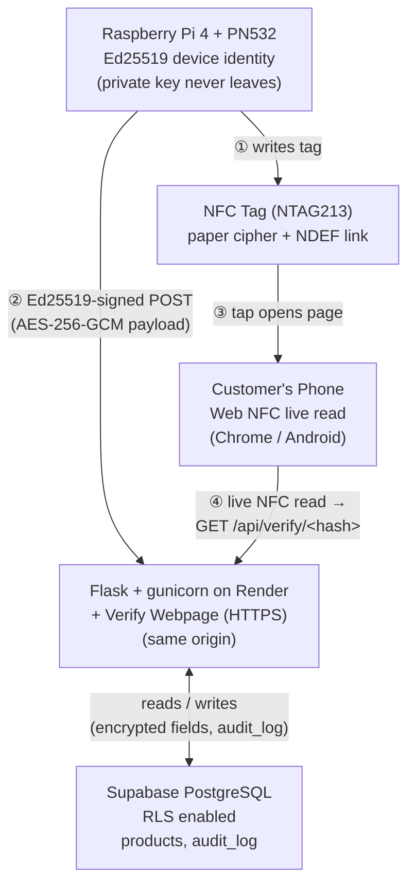

# NFC Medicine Authenticity System
### System Architecture and Security Report
*Prepared as the technical basis for a research paper*

## Abstract

This report documents the design and implementation of an NFC-based anti-counterfeiting system for pharmaceutical packaging. A Raspberry Pi 4 with a PN532 NFC module writes an authenticity record to an NTAG213 tag at packaging time and registers the record with a cloud backend; a consumer later taps the tag with a smartphone to receive a server-verified authenticity result. The system implements two independent cryptographic paths on the same tag: a novel lightweight block cipher (the subject of this work) and a production-grade path (AES-256-GCM, Ed25519 device-signing) that secures the deployed system independently of the novel cipher's strength. We describe the full architecture, the cryptographic constructions used, the defense-in-depth security model, an empirical evaluation against four attack classes (replay, clone, brute-force, man-in-the-middle), and the system's current limitations.

---

## 1. System Architecture

The system has three physical/logical participants: the **packaging-time writer** (Raspberry Pi 4 + PN532), the **backend** (Flask, deployed on Render behind HTTPS, backed by a Supabase PostgreSQL instance), and the **consumer's phone**, which also serves the verification webpage the backend hosts. There is no separate frontend server; the backend serves both the REST API and the static verification page from the same origin.

Two flows share the same backend: the write flow (steps 1–2, executed once per product at packaging time) and the verify flow (steps 3–4, executed every time a consumer checks a tag).

### 1.1 Write flow

- The Pi reads the tag's factory hardware UID via the PN532 and derives per-tag key material locally, without any value being generated on the tag itself.
- It writes a 16-byte ciphertext block (the novel cipher, Section 2.1) to NFC pages 4–7, and a standard NDEF URI record (Section 2.4) to pages 8 onward, pointing at the verification webpage.
- It independently encrypts the full product record with AES-256-GCM (Section 2.2) and submits it to the backend over HTTPS, signed with an Ed25519 device signature (Section 2.3) that proves the request originated from this specific, registered device.
- The backend validates the signature, enforces nonce uniqueness (Section 3.2), decrypts only the manufacture date to compute an expiry date, and stores the remaining fields as ciphertext.

### 1.2 Verify flow

- On browsers that support the Web NFC API (Chrome for Android), tapping the tag or opening the verification page presents a live-scan control. Activating it performs a fresh, physical read of whatever tag is touching the phone at that moment — not a value stored in the page's URL.
- The browser computes SHA-256 of the freshly-read UID client-side and requests `GET /api/verify/<hash>` using that live-computed value.
- On browsers without Web NFC support, the page falls back to the hash embedded in the tag's NDEF link, with an explicit on-page disclosure that live verification was unavailable.
- The backend looks up the record, decrypts it server-side, checks it for tampering and expiry, and returns only a status word and, if authentic, plain display fields — never ciphertext, IVs, or key material.

---

## 2. Cryptographic Design

The system implements two cryptographic paths on independent tag regions and independent database columns, distinguished by a `crypto_version` field (`paper_v1` / `aes_gcm_v1`). This separation is deliberate: the novel cipher is preserved unmodified as the object of study, while the production deployment's actual security guarantees rest entirely on the second path.

### 2.1 The novel lightweight cipher (paper_v1)

**Key derivation.** For a tag with hardware UID *U*, four key characters are derived as HMAC-SHA256(*Kshared*, *U*), taking the first 4 output bytes *b0…b3* and mapping each to a printable ASCII character via 32 + (*bi* mod 95). Each character *c* is then reduced to an integer *key_pair* = (msb(*c*) mod 2) × 10 + lsb(*c*), where msb/lsb split the character's 8-bit code into its upper and lower nibble. The four resulting values are split into two halves, K1 (applied left-to-right) and K2 (applied right-to-left on decryption).

**Block transform.** Plaintext is padded to a multiple of 10 bytes with the byte `_` (0x5F) and split into 10-byte blocks. For each *key_pair* = 10·*d* + *s* applied to a block, bytes from offset *d* to the end of the block are transformed: if *s* = 0 or *s* > 8, every byte in that range is bitwise inverted; otherwise, each byte is circularly shifted by *s* bit positions, left for K1 keys and right for K2 keys during encryption (reversed on decryption). A CBC-style wrapper XORs each 10-byte plaintext block against the previous ciphertext block (or a random 10-byte IV for the first block) before the transform is applied, providing block-to-block diffusion.

**Honest characterization.** This construction has a small effective keyspace (each key character contributes at most one of 20 distinct *key_pair* values) and its non-linear component is limited to conditional bit inversion; it is not claimed to meet modern security margins and is not the mechanism protecting the deployed system. It is retained unmodified in `crypto_paper.py` and demonstrated in isolation (Section 4) so this report's results are reproducible independent of the production hardening described below.

### 2.2 Production confidentiality: AES-256-GCM

Every field (`product_id`, `batch_id`, `mfg_date`, `tag_uid`) is encrypted with AES-256-GCM under a key *Ktag* = HKDF-SHA256(*salt*=none, *ikm*=`AES_MASTER_KEY`, *info*="nfc-tag-aes-key:" + `tag_uid_hash`) with a fresh random 96-bit nonce per encryption. Because *Ktag* is derived independently by both the Pi and the backend from a shared master secret and the tag's (public) hash, **no key material is ever transmitted in a request or persisted in the database** — a structural fix for the predecessor design, in which the paper cipher's derived key characters were stored in the database in cleartext. GCM's built-in authentication tag additionally detects any single-field ciphertext modification on decryption.

### 2.3 Write authentication: Ed25519 device-signing

Every `POST /api/products` request is signed with Ed25519 (RFC 8032) over the canonical payload *ts* + JSON(*body*, sorted keys, compact separators), where *ts* is a Unix timestamp also checked against a 30-second freshness window. The Raspberry Pi holds the private signing key exclusively; the backend holds only the corresponding public key(s) (`PI_PUBLIC_KEYS`). Verification (`crypto_signing.py`) tries the signature against every trusted public key and fails closed — malformed hex, wrong-length keys, and invalid signatures are all treated identically as rejection, never raising an exception that could leak information via error behavior.

This replaced an earlier HMAC-SHA256 scheme keyed on one symmetric secret shared between the Pi and the backend's own configuration (including its cloud host's environment variables). The symmetric design meant that leaking the backend's configuration alone — without ever touching the Pi — was sufficient to forge arbitrary writes. Ed25519's asymmetry closes this: an attacker who obtains the backend's entire configuration still cannot produce a valid signature, because doing so requires the private key, which exists only on the physical device.

### 2.4 Physical-tag binding: live NFC verification

A construction limitation independent of both crypto paths above is that an NDEF URI record is static text: any party who reads it once (a tap, a photograph, the printed QR fallback) can write an identical record onto an unrelated tag, which the original design would then treat identically to the genuine article, since the verification page never had physical contact with the tag being evaluated. We address this using the Web NFC API (`NDEFReader`, Chrome for Android, requires a secure context): rather than trusting the `t=` value already present in the URL, the page performs a live read of whatever tag is physically touching the phone, computes SHA-256 of that freshly-read UID in the browser (verified byte-for-byte identical to the backend's `hashlib.sha256` computation), and looks up that value instead. A copied NDEF record on a different physical tag now simply resolves to no record (or a different one), rather than inheriting the genuine tag's identity. This requires no backend changes: `GET /api/verify/<hash>` is agnostic to whether its input came from a live read or a URL parameter — only the trustworthiness of that input changes.

This measure defeats the general case (any off-the-shelf blank tag). It does not defeat a specifically-sourced UID-rewritable ("magic") clone tag paired with copied content, since standard NTAG213 silicon has no mechanism to prove UID authenticity beyond the UID value itself. Closing that residual gap requires hardware with per-tap cryptographic authentication (e.g. NXP NTAG 424 DNA's Secure Unique NFC messaging); see Section 6.

---

## 3. Security Architecture

The mechanisms below are independent layers: each was introduced to close one specific abuse case in the original localhost prototype, and defeating one does not defeat the others.

| Mechanism | Description | Reference |
|---|---|---|
| Write authentication | Ed25519 device signature required on every POST; a request without a valid signature from a registered key is rejected before any data is touched. | Section 2.3 |
| Replay protection | 30-second timestamp freshness window, plus a database-level UNIQUE constraint on the write nonce — the latter holds even against a freshly re-signed request over an already-used nonce. | backend/app.py, migrate.py |
| Confidentiality | AES-256-GCM with per-tag HKDF-derived keys; no key material transmitted or stored at rest. | Section 2.2 |
| Integrity / tamper detection | GCM authentication tag (per-field) plus a SHA-256 hash over all four ciphertext fields together (catches cross-field/cross-record substitution a per-field tag alone would miss). | backend/app.py compute_payload_hash |
| Physical tag binding | Live Web NFC read overrides any static URL value where supported. | Section 2.4 |
| Access control | Administrative endpoints require a static API key compared in constant time; the public verify endpoint never returns ciphertext, keys, or secrets. | backend/admin_auth.py |
| Rate limiting | Per-route limits (verify 20/min, product write 30/min, admin list 60/min, admin key fetch 10/min) blunt both signature brute-forcing and tag-hash enumeration. | flask-limiter |
| Audit logging | Every write and verify attempt, successful or not, is recorded with event type, result, tag hash, source IP, and timestamp. | backend/audit.py, audit_log table |
| Database-level isolation | Row Level Security enabled on both tables in Supabase with no policies granted to anon/authenticated roles, closing off the project's auto-generated public REST API as an access path independent of the Flask backend. | supabase_schema.sql |
| Transport security | Backend served over HTTPS (Render-managed TLS); Web NFC itself additionally requires a secure context to operate at all. | Render deployment |

---

## 4. Threat Model and Empirical Evaluation

Each defense above was validated with a dedicated automated test against a live running instance of the backend (not a mocked unit test), exercising real HTTP requests, real database state, and real rate-limit counters. The suite is organized by attack class:

| Attack / scenario | Defense | Verified by (backend/tests/) |
|---|---|---|
| Replay a captured write request | Nonce UNIQUE constraint + timestamp window; holds even under a freshly-forged valid signature over the same nonce | test_replay.py |
| Register a counterfeit product without the device's private key | Ed25519 signature requirement on every write | test_clone.py |
| Impersonate a device using an unregistered or garbage signature | Signature verified against the specific set of trusted public keys; a well-formed signature from a key not in that set is rejected, as is a random signature even with full knowledge of the trusted keys | test_device_impersonation.py |
| Scan a cloned/blank tag | Server-side lookup by hash returns "unknown" for any unregistered value; live NFC read (Section 2.4) prevents a copied link from resolving to the genuine record at all | test_clone.py |
| Brute-force signatures / enumerate tag hashes | Rate limiting (429) engages on every route under sustained request volume | test_bruteforce.py |
| Tamper with ciphertext in transit | Signature verification runs before decryption; a modified body under a forged signature never reaches storage | test_mitm.py |
| Tamper with a stored record directly (e.g. DB access) | payload_hash mismatch or GCM authentication failure flips the verify result to "tampered", which takes precedence over every other status | test_mitm.py |
| Exfiltrate key material from network traffic or the database | Keys are derived independently by each party and never transmitted or stored (aes_gcm_v1 path) | crypto_modern.py |

The suite additionally cross-references each test's outcome against the live `audit_log` table (via `report.py`), so results reflect what the server itself recorded, not only what the test client observed. All results in this section are reproducible by running `pytest tests/ -v` against a running instance of the backend.

---

## 5. Deployment Architecture

- **Backend:** Flask application served by gunicorn, deployed on Render (a managed PaaS) with automatic HTTPS. The application is stateless with respect to compute; all persistent state lives in the database.
- **Database:** Supabase-managed PostgreSQL, connected via the session pooler endpoint (the direct-connection endpoint resolves IPv6-only, which is unreachable from some hosting providers' egress networks, including the one used here). Row Level Security is enabled as described in Section 3.
- **Device:** Raspberry Pi 4 with a PN532 NFC module (I²C), running the packaging-time writer script continuously in an operator-attended loop.
- **Client:** No native application; the consumer-facing surface is a static, framework-free webpage served by the same Flask application, opened either by tapping a tag (which invokes the device's native NDEF handling) or by direct navigation.

---

## 6. Limitations and Future Work

- **Residual physical-clone risk.** Live NFC verification (Section 2.4) defeats copying a tag's link onto arbitrary blank hardware, but not a UID-rewritable clone tag paired with copied content. Closing this fully requires migrating to SUN/SDM-capable silicon (e.g. NTAG 424 DNA), which generates a fresh cryptographic proof per physical tap from a non-extractable per-chip key; this is identified as the highest-value next step and is out of scope for the current hardware.
- **Web NFC platform coverage.** Live verification is currently available only on Chrome for Android; iOS and desktop browsers fall back to the pre-existing URL-trust model, with the reduced trust level disclosed on-page rather than silently assumed.
- **Novel cipher formal analysis.** Section 2.1's construction is evaluated here only by description and by the empirical test suite; a full differential/linear cryptanalysis and a quantitative keyspace comparison against established lightweight ciphers (e.g. PRESENT, SIMON/SPECK) is planned as the primary contribution of the accompanying paper.
- **Randomness evaluation.** The nonce generator (Python's `secrets` module) has not yet been evaluated against the NIST SP 800-22 statistical test suite; this is planned future work.
- **Operational scaling.** Rate-limiter state is currently in-process memory, correct for the current single-instance deployment but would need a shared store (e.g. Redis) if scaled to multiple concurrent server instances.

---

## 7. Conclusion

This system demonstrates that a novel, resource-constrained cryptographic scheme can be evaluated and documented honestly alongside a genuinely deployed, production-hardened system, without either compromising the other: the paper cipher's results remain reproducible in isolation, while the system a consumer actually interacts with is secured independently by AES-256-GCM, Ed25519 device-signing, database-level access isolation, and live physical-tag verification. Four classes of attack (replay, clone/impersonation, brute-force, man-in-the-middle/tamper) were implemented and empirically validated against the live deployment rather than asserted theoretically. The system's remaining limitations are identified explicitly rather than left as undocumented gaps, with a concrete hardware-based path (NTAG 424 DNA) identified to close the most significant of them.

---

*Prepared as a technical basis for a research paper submission. Source: github.com/VishwarajSharma42/major-project-nfc. Reproducibility: schema in backend/supabase_schema.sql, test suite in backend/tests/, deployed instance at major-project-nfc.onrender.com.*
